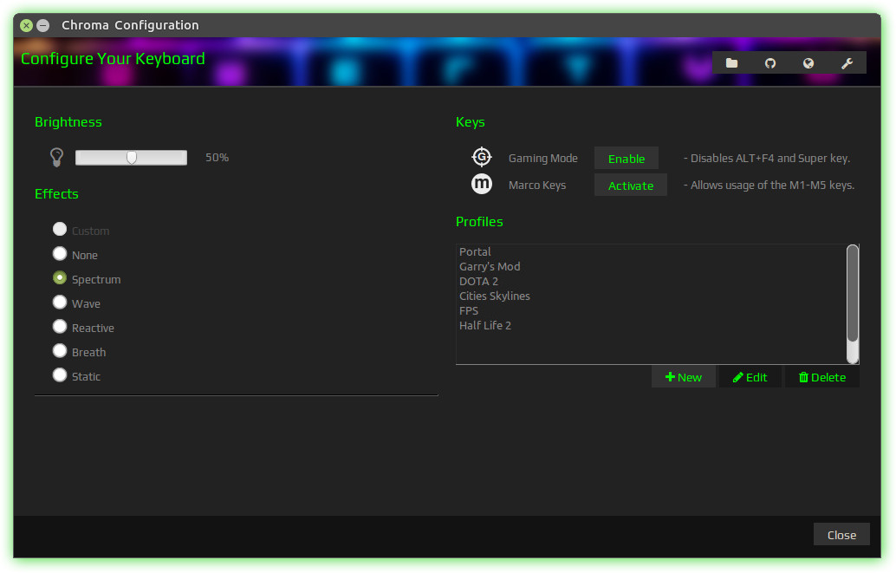
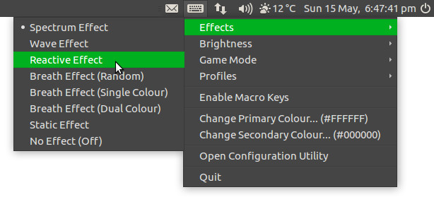

# Polychromatic Controller

A graphical front end for managing the [Chroma Linux Drivers](http://pez2001.github.io/razer_chroma_drivers/) for Razer peripherals on GNU/Linux.

## Features

### Controller

A central place to change the behaviour of your Razer peripheral: Effects, brightness, toggling gaming mode or activating macro keys.

Also includes profile support and customisation options:

* Changing the indicator icon.
* Specifying preferred colours.
* Setting effects or profiles at log-in.
 * _Currently requires Tray Applet to run on start-up._

### Tray Applet

Set effects, brightness, game mode and macro features, plus load your saved profiles from the tray.

## Dependencies

Based on Python3 and WebKit.

* [Razer Python Modules](https://github.com/pez2001/razer_chroma_drivers)
* gir1.2-webkit-3.0
* python3-gi
* gir1.2-appindicator3-0.1
