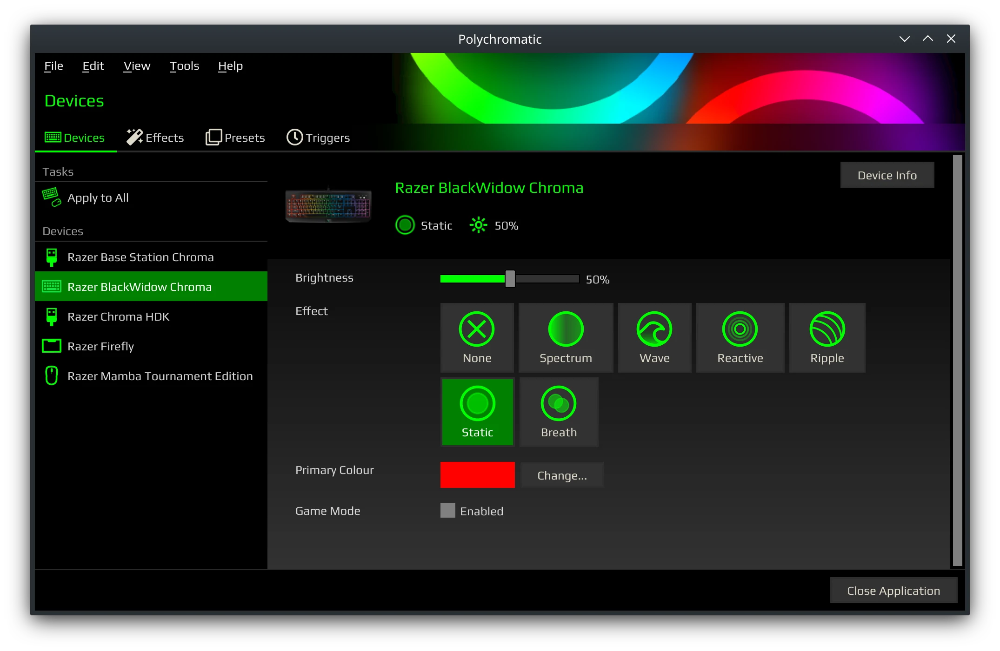

An open source RGB lighting management front-end application to customise
[OpenRazer] peripherals on GNU/Linux. Soon to be vendor agnostic!

[](https://github.com/polychromatic/polychromatic/actions?query=workflow%3ABuild)
[](https://github.com/polychromatic/polychromatic/actions?query=workflow%3A%22Unit+Tests%22)
[](https://github.com/polychromatic/polychromatic/releases)



### [https://polychromatic.app](https://polychromatic.app)


## About

Polychromatic is a vendor agnostic front-end for managing lighting, RGB effects
and some special functionality for keyboards, mice, keypads and just about any
other gaming peripheral on your GNU/Linux system.

The software aims to make it easy to create and co-ordinate lighting effects
that work across all compatible hardware, even if you switch to another brand
also supported by Polychromatic.

<!--
Presets and triggers enables you to switch your lighting on-the-fly
to match the application or game that's currently playing.
-->

[View Features](https://polychromatic.app/features/) |
[View Screenshots](https://polychromatic.app/screenshots/) |
[View FAQs and Documentation](https://docs.polychromatic.app/)


## Device Support

Polychromatic on its own is just a frontend, it needs at least one backend
installed to provide the actual communication with the hardware.

**Currently, [OpenRazer](https://openrazer.github.io) is the only supported
backend at the moment.** (Being vendor agnostic is a fairly new objective!)

In future, this project would like to add support for:

* [OpenRGB](https://github.com/polychromatic/polychromatic/issues/340) - supports many brands, including GPU, MB and RAM modules.
* [phue](https://github.com/polychromatic/polychromatic/issues/296) - for Philips Hue support

> **Note:** Between v0.7.0 and the next version, there will be some major
> refactoring in the backend classes.

[View Device List](https://polychromatic.app/devices/)


## Download

Instructions for each supported distro are provided on the website:

* <https://polychromatic.app/download/>

Installing packages from a software repository is recommended as this will keep
the software up-to-date, and your package system will keep track of dependencies.


If you need to test a specific change, grab an artifact [from the Actions tab](https://github.com/polychromatic/polychromatic/actions?query=workflow%3ABuild)
and extract to a folder (GitHub requires you to be signed in to download these).
Make sure you have installed the [dependencies](https://docs.polychromatic.app/dependencies/).


## Hacking / Contributing

Providing all the [dependencies](https://docs.polychromatic.app/dependencies/)
(including build ones) are installed, you can run the application directly from
the Git repository folder without installing. Obtained the source code by either
running `git clone` or [downloading a copy as a zip folder](https://github.com/polychromatic/polychromatic/archive/refs/heads/master.zip).

Your configuration and cache is isolated into a `savedatadev` directory when
running via `polychromatic-controller-dev`. To isolate the tray applet and
command line interfaces, set this environment variable:

    export POLYCHROMATIC_DEV_CFG=true

Then run the desired application:

    ./polychromatic-controller-dev
    ./polychromatic-tray-applet
    ./polychromatic-cli

While most of the project isn't compiled like conventional software, there are
a couple of pieces that do:

    ./scripts/build-styles.sh
    ./scripts/build-locales.sh

These are performed by `polychromatic-controller-dev` and only need to be
performed once, unless there's been code changes.


## Building

If you have custom installation requirements, Polychromatic can be put together
using [Meson] and [Ninja].

* You’ll need an implementation of SASS to compile Polychromatic’s Controller Qt styling.
  `sassc` is widely available, but there’s other implementations that could be used.

* `intltool` is required for compiling translations.

* `git` is needed for retrieving the source code.

To build:

```
git clone https://github.com/polychromatic/polychromatic.git
cd polychromatic
meson build
ninja -C build install
```

[View Dependencies](https://docs.polychromatic.app/dependencies/)

[Meson]: https://mesonbuild.com/
[Ninja]: https://ninja-build.org/


## Something not working?

For [OpenRazer] users, occasionally, issues are caused by an improper driver
installation. Polychromatic includes a troubleshooter to identify common problems.
[See our FAQs on OpenRazer](https://docs.polychromatic.app/openrazer/#my-device-is-showing-up-as-unrecognised)
if your device is not showing up or shows an error when changing settings.

For bugs specific to Polychromatic, [please raise an issue here](https://github.com/polychromatic/polychromatic/issues/).


## Translations

The software can speak multiple languages!
[Here's a guide](https://docs.polychromatic.app/translations/) if you'd like to contribute.


## Donations

If you love this software and wish to leave a little something to excite the
developer, you're welcome to do so [via paypal.me](https://www.paypal.me/LukeHorwell).
Thank you for your generosity!

[OpenRazer]: https://openrazer.github.io
