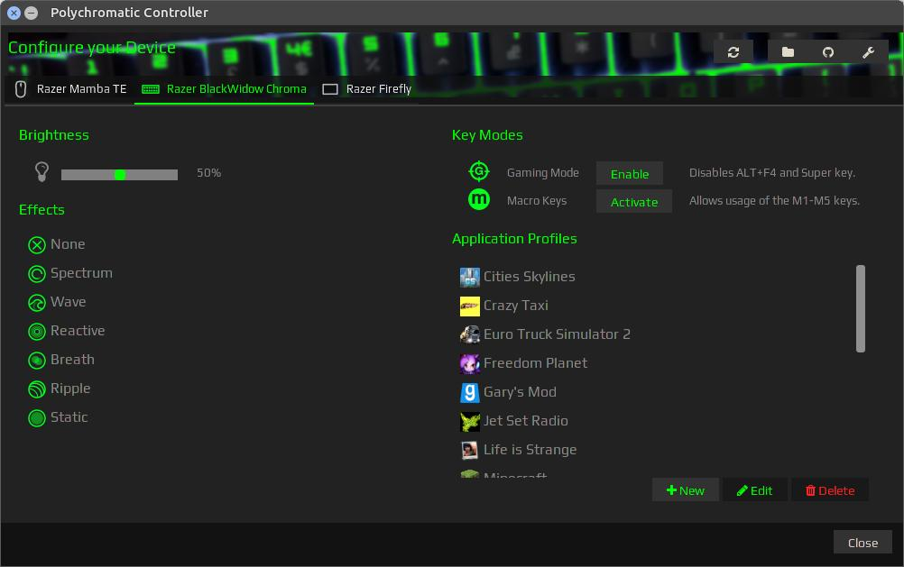
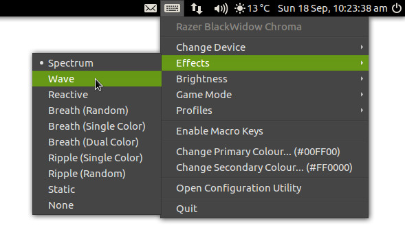

# Polychromatic

A graphical front end to manage your Razer peripherals on GNU/Linux.

## Features

### Controller

An application that allows you to configure Razer peripherals that uses the
[Razer Drivers for Linux](http://terrycain.github.io/razer-drivers/) daemon.

Also includes application profile support and customisation options:

* Changing the indicator icon.
* Specifying default colours.
* Setting effects or profiles at log-in (via Tray Applet)

### Tray Applet

Quickly set effects, brightness, keyboard features or load saved profiles
from your desktop's indicator or notification area.

## Driver Installation

###  Razer Drivers for Linux
This application requires the [razer-drivers](http://terrycain.github.io/razer-drivers/) driver and daemon.

Please see the [project page](http://terrycain.github.io/razer-drivers/#download) for installation for your distribution.

Ubuntu and Linux Mint users can install the drivers and daemon via this PPA:

    sudo add-apt-repository ppa:terrz/razerutils
    sudo apt update
    sudo apt install python3-razer razer-kernel-modules-dkms razer-daemon razer-doc

## Polychromatic Installation

####  Ubuntu 16.04+ / Linux Mint 18+

Polychromatic can be installed via the PPA, which keeps the application up-to-date.

    sudo add-apt-repository ppa:lah7/polychromatic
    sudo apt update
    sudo apt install polychromatic

####  Ubuntu 14.04 / Linux Mint 17

Earlier distributions will not be able to use the latest version of this software as it
depends on a newer version of WebKit2 which is not available in earlier releases.

Instead, [the legacy branch](https://github.com/lah7/polychromatic/tree/legacy) contains
an older version (v0.1.0 / v0.2.0.1) that will not receive further updates as it requires
the original driver/daemon:

* [razer-chroma-driver_20160612_ubuntu_amd64.deb](https://github.com/lah7/polychromatic/releases/download/v0.2.0/razer-chroma-driver_20160612_ubuntu_amd64.deb)
* [polychromatic_0.1.0_all.deb](https://github.com/lah7/polychromatic/releases/download/v0.2.0/polychromatic_0.1.0_all.deb)

####  Debian

Packages built for Ubuntu are also compatible with Debian.

Add this line to your `/etc/apt/sources.list`:

    deb http://ppa.launchpad.net/lah7/polychromatic/ubuntu trusty main

Then add the public key to verify the packages:

    gpg --keyserver hkp://keyserver.ubuntu.com:11371 --recv-keys A4BFC960
    gpg --armor --export A4BFC960 | sudo apt-key add -

Followed by updating your Apt sources:

    sudo apt-get update

Otherwise, standalone packages are available from the [releases page](https://github.com/lah7/polychromatic/releases/latest/).

####  Other Distributions / Manual Installation

See further below for which dependencies you will require to install first.

    git clone https://github.com/lah7/polychromatic.git
    cd polychromatic
    git checkout stable
    sudo ./install/install.sh

**If you'd like to use the latest development version** (but potentially unstable), skip this line: `git checkout stable`.

To update your installation at a later date:

    ./install/update.sh

### Dependencies

**All:**
* [python3-razer](https://github.com/terrycain/razer-drivers)
* [razer-daemon](https://github.com/terrycain/razer-drivers)

**Arch:**
* [webkitgtk](https://www.archlinux.org/packages/extra/x86_64/webkitgtk/)
* [python-gobject](https://www.archlinux.org/packages/extra/x86_64/python-gobject/)
* [python-setproctitle](https://www.archlinux.org/packages/community/x86_64/python-setproctitle/)
* [python-requests](https://www.archlinux.org/packages/extra/any/python-requests/)
* [libappindicator](https://aur.archlinux.org/pkgbase/libappindicator/?comments=all)

**Debian and Ubuntu 16.04+:**
* [gir1.2-webkit2-4.0](https://packages.debian.org/sid/gir1.2-webkit2-4.0)
* [python3-gi](https://packages.debian.org/sid/python3-gi)
* [python3-setproctitle](https://packages.debian.org/sid/python3-setproctitle)
* [python3-requests](https://packages.debian.org/sid/python3-requests)
* [gir1.2-appindicator3-0.1](https://packages.debian.org/sid/gir1.2-appindicator3-0.1)

## Something not working?

* Check that the driver and daemon are [properly installed](https://github.com/terrycain/razer-drivers#installation) for your distribution.
* Check that your [device has daemon support](https://github.com/terrycain/razer-drivers#device-support).
* For DBUS, daemon or driver bugs, [see if an issue](https://github.com/terrycain/razer-drivers/issues) has been raised on the [razer-drivers repository](https://github.com/terrycain/razer-drivers), otherwise [please create a new issue there](https://github.com/terrycain/razer-drivers/issues/new).

For visual or functional problems with Polychromatic, [please raise an issue here instead](https://github.com/lah7/polychromatic/issues/new).

## Translations

If you'd like to translate this application, take a look
[at this wiki page](https://github.com/lah7/polychromatic/wiki/How-to-translate-the-application).

