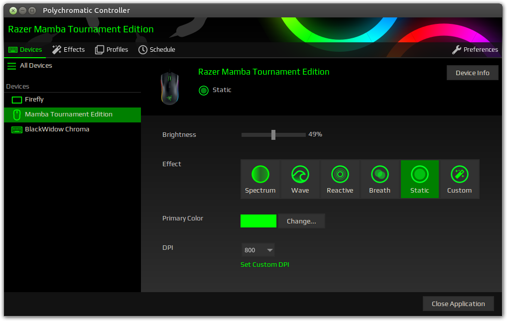

A front-end to customise your Razer perpherials under GNU/Linux. Powered by [OpenRazer](https://openrazer.github.io).

### [https://polychromatic.app](https://polychromatic.app)
Take a look at the website for features, screenshots, downloads and documentation.

------------

## Device Support

This software is powered by the [OpenRazer](https://openrazer.github.io) daemon, check
their [supported devices](https://openrazer.github.io/#devices) grid to confirm whether your device is
supported by the daemon. If the daemon supports it, Polychromatic will see it too.

Due to the diversity of devices, not all of a device's features may be supported right away.
[Check out the roadmap](https://polychromatic.app/docs/roadmap/) for progress.

## Getting Started

* [Head to the downloads page](https://polychromatic.app/download/) for instructions for your distribution.
* For build instructions, [see the "Manual Installation" page](https://polychromatic.app/download/manual/).
* For dependencies and other documentation, [see the docs](https://polychromatic.app/docs/).
* Curious? [Here's some FAQs](https://polychromatic.app/docs/faqs/)

## Troubleshooting

Occasionally, issues are caused by an improper installation of OpenRazer, which covers
DBus, the daemon and the driver. [Check if an issue already exists](https://github.com/openrazer/openrazer/issues)
for your specific device before [creating a new issue](https://github.com/openrazer/openrazer/issues/new).

For visual or functional problems with Polychromatic, [please raise an issue here instead](https://github.com/polychromatic/polychromatic/issues/new).

## Translations

The software is ready to speak multiple languages!
[Here's a guide](https://polychromatic.app/docs/translations/) if you'd like to contribute.

## Donations

If you love this software and think it's worth a few quid, euros or dollars,
you're very welcome to leave a little something to excite the developer!
Thank you for your generosity.

If you don't wish to use Ko-fi, [there's also PayPal](https://www.paypal.me/LukeHorwell).
